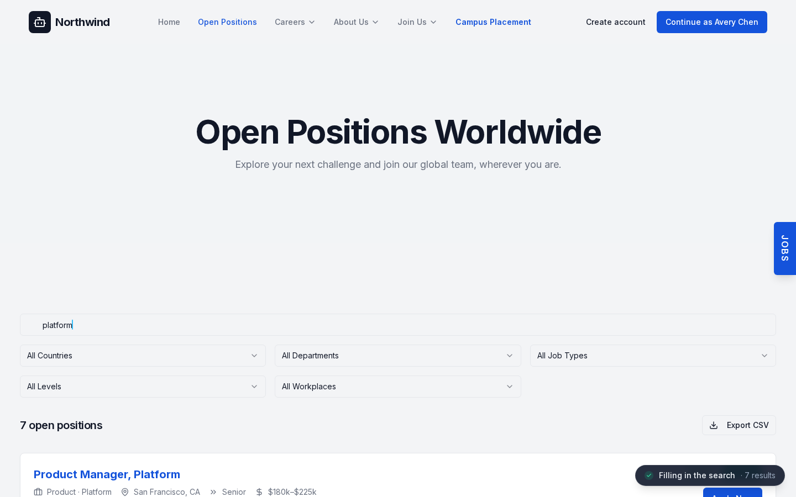
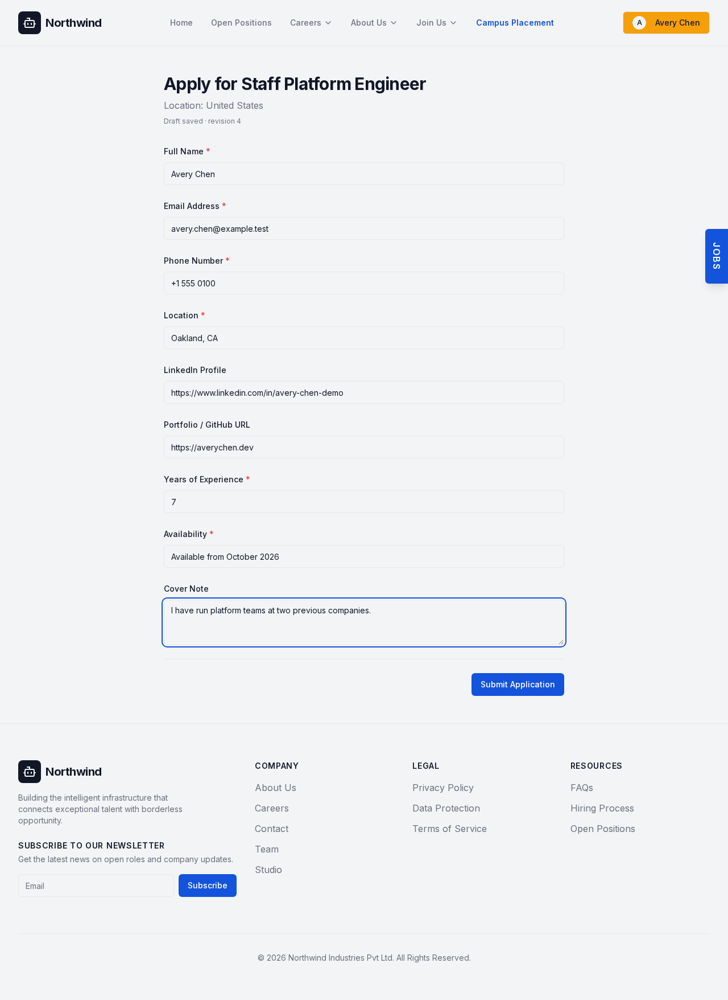
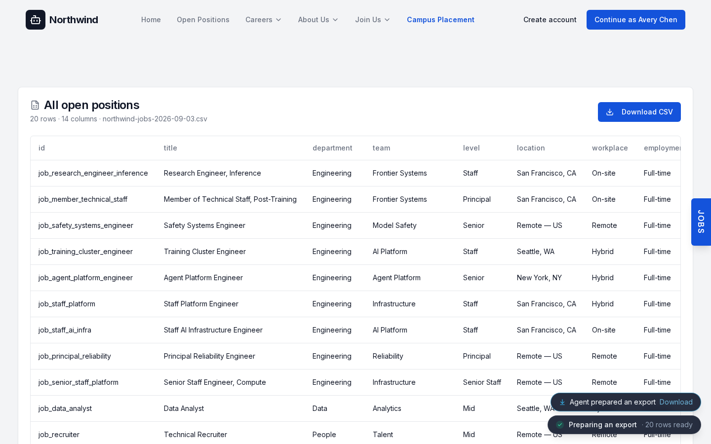

# Careers WebMCP

> **The careers page is the connector.**

A working careers site that hands its own capabilities to whatever browser
agent arrives with the visitor. No connector to install. No API key. No MCP
server. No DOM scraping. No AI SDK anywhere in the page.

**Live demo:** https://careers-webmcp.vercel.app/careers/open-positions

Open it in ChatGPT's in-app browser or Chrome with WebMCP enabled and ask:

> **"I'm on this careers site. Find me engineering roles at staff level or
> above, in San Francisco or remote, paying at least $220k base — then show me
> that search on the page."**

Six roles come back, and then the site's own search box types the query
character by character and the visible list narrows to match. You are not
reading a summary of your search in a side panel. You are watching it run on
the page.

| Careers site with an agent search in flight | Agent + human co-editing one application draft |
| --- | --- |
|  |  |

---

## The argument

Every way an agent can help you on a website today requires taking your
authority and giving it to the agent.

A scraper gets your whole session and infers meaning from markup — it decides
which `<div>` is a job, which button means Save, which form is an application.
A traditional MCP connector gets a token you pasted and acts on your behalf
forever, out of sight of the page. In both cases the agent's power is a copy of
yours, and the site has no say in what it can do.

**WebMCP inverts that. The publisher defines the capabilities, so the publisher
defines the limits.**

That single property is why this project exists. A careers site can safely
expose *"fill in my application"* while making *"submit it"* structurally
impossible for an agent — not guarded, not confirmed, **impossible** — because
the site owns both the tool surface and the code behind it.

Here is the whole security model, and you can verify it in about five seconds:

```bash
# The WebMCP layer never calls either commit function:
grep -cE "submitApplication\(|completeSignUp\(" src/webmcp/tools.ts   # → 0

# Each has exactly one caller in the whole app, both inside an onClick:
grep -rnE "submitApplication\(|completeSignUp\(" src/app
#   src/app/(public)/careers/application/[slug]/page.tsx:251   Submit Application button
#   src/app/(public)/careers/signup/page.tsx:105               Create account button
```

`src/webmcp/tools.ts` imports eight functions from `@/domain/applications` —
`listApplications`, `getApplication`, `findApplicationByJob`,
`startApplication`, `updateApplication`, `applicationUrl`,
`validateApplicationFields`, `APPLICATION_FIELD_NAMES`. `submitApplication` is
not among them. It imports four from the sign-up store; `completeSignUp` is not
among them. (The naive grep matches 2 lines, both the *schema* name
`submitApplicationSchema` — hence the call-shaped pattern above.)

There is no `confirm: true` escape hatch because **there is no second code path
to reach.**

The agent does the typing. The person stays the person, and sends the thing.

---

## The problem this actually solves

Job seekers do an enormous amount of unpaid data entry, and candidate funnels
leak in three predictable places:

1. **Search that can't answer the question you have.** Boards filter by
   keyword and country. Nobody's real question is "keyword: engineer." It's
   "staff or above, SF or remote, at least $220k."
2. **The account wall.** A form standing between a person and a role they have
   *already decided to apply for*. This is where the most motivated candidates
   are lost — not for lack of interest, for lack of patience.
3. **Retyping the same nine fields** — name, phone, location, availability,
   portfolio link — into a fresh form at every employer, forever.

The audience is candidates browsing employer career sites, and the employers
who lose them. All three of those are data entry. **None of them is a
decision.** That's exactly the line this project draws in code: the agent takes
the typing, the human keeps the two decisions that matter — *who I am* and
*what I send.*

An employer would actually ship this. That is the point. A careers site that
let an agent create accounts and fire off applications is a liability for the
candidate and a spam firehose for the employer. One that lets an agent *prepare*
work a human approves is strictly better for both, and costs the candidate
nothing.

---

## Why WebMCP specifically, and not MCP or automation

A careers site is a **destination you visit occasionally and would never
configure as a permanent integration.** Nobody installs an MCP connector for
one employer's job board, uses it for ninety minutes, and maintains it.

| | Traditional MCP | Browser automation | Careers WebMCP |
| --- | --- | --- | --- |
| Setup | Install a connector | None | Visit the website |
| Lifetime | Persistent | Per-run | The current visit |
| Auth | Configure separately, copy a token | Rides your whole session | The site session the human already has |
| Site context | Must be recreated | Inferred from markup | Published by the page that knows |
| Breaks when | The API changes | The CSS changes | It doesn't; the publisher maintains it |
| Who sets the limits | The connector author | Nobody | **The publisher** |
| Distribution | One integration per service | One script per site | The publisher adds WebMCP once |

WebMCP doesn't replace MCP. It covers the long tail — every Greenhouse board,
Workday portal, university portal, marketplace and support site you touch twice
a year and would never configure. **The open web becomes its own integration
registry.**

---

## What humans and agents do together here

```
HUMAN  visits the careers site
AGENT  careers_search_jobs {departments:[Engineering], levels:[Staff, Senior Staff, Principal],
                            locations:[San Francisco, Remote], minCompensation:220000}
SITE   6 structured matches — from the same scorer that renders the visible list
AGENT  careers_set_search_view → the query types itself into the site's search box
AGENT  careers_open_job → the normal job page opens in the user's tab
HUMAN  reads it, clicks Save
AGENT  careers_get_saved_jobs sees that save — same store, not a copy
HUMAN  "set me up an account, I'm Sam Rivera, sam.rivera@example.test, Austin, 6 years"
AGENT  careers_create_account fills the real sign-up form → awaiting_human_confirmation
HUMAN  presses Create account                                  ← only a human can
AGENT  careers_start_application → the normal form opens, prefilled
AGENT  careers_update_application (revision 1) fills portfolio + availability
HUMAN  types their own cover note                                 (revision 3)
AGENT  careers_get_application → revision 3, patches only the empty fields
       a write still carrying revision 2 → STALE_APPLICATION, human text survives
AGENT  careers_submit_application validates, rings the Submit button, stops
HUMAN  presses Submit Application                              ← only a human can
```

Four things here were impractical before:

- **Compound questions against one employer's board.** No filter UI exists for that query. The site's own search function does, and now it's addressable.
- **The answer landing on the page you're looking at**, in the site's real controls, rather than being described back to you.
- **Co-editing one draft.** Not the agent's copy of your application — the same draft object, with your edits structurally protected.
- **Reasoning over a whole result set** without reading twenty job descriptions into the agent's context.

---

## How it's implemented

### The shape

```
Human UI components ─┐
                     ├─→  src/domain/*  (session · ui-context · saved-jobs
WebMCP tools  ───────┘                   applications · signup · exports)
                                                    ↓
                                         services / mock adapter
```

Both callers import **the same module-level functions.** Not a parallel service
layer, not a mirrored API — `src/webmcp/tools.ts` literally does
`import { updateApplication } from '@/domain/applications'`, and so does the
application page. That is why the page and the agent cannot drift.

`src/webmcp/WebMCPProvider.tsx` feature-detects `document.modelContext` and
registers the tools once per page load, unregistering via an `AbortSignal` on
unmount, guarded by a module-level `WeakSet` so React StrictMode's double-mount
can't double-register. Registration failure is caught and swallowed — it can
never break the site. If WebMCP is absent, nothing registers and the page is
byte-for-byte a normal careers site.

**Tools are registered once and read live state at call time.** There is no
re-registration on route change or sign-in; a tool called on any page sees the
current truth.

### Nothing reads the DOM — the page tells you where it is

`careers_get_context` doesn't scrape and doesn't primarily parse the URL. The
pages themselves publish their context:

```tsx
// rendered by the job detail page
<CurrentJobBridge jobId={job.id} />        // sets currentJobId on mount, null on unmount
<CurrentApplicationBridge applicationId={draft?.id ?? null} />
```

The component that *knows* which job it is announces it. `PageContextBridge`
does the same for pathname and search params, straight from the Next.js router.
A URL regex exists only as a first-paint fallback. This is "the page is the
integration" as an actual mechanism rather than a slogan.

### One scorer, two consumers — and a protocol constraint solved honestly

`filterAndRankJobs(catalog, query)` is a deterministic weighted scorer: hard
filters (department, level, location with `sf`/`nyc` aliases, workplace,
employment type, skills, compensation floor/ceiling) then a weighted token
score across title (10), team (5), department (5), skills (4), level (3),
location (3), summary (2), description (1), with a stable tiebreak on posted
date then id. **No embeddings, no LLM.** A query token that matches nothing
eliminates the job outright.

It backs the visible job listing *and* `careers_search_jobs`. `searchJobs()`
layers the tool-result page limit (10 default / 30 max) on top of it.

Exports call `filterAndRankJobs` **directly, unbounded** — and that is not a
loophole, it's the resolution of a real WebMCP constraint. A tool result is a
plain JavaScript value: no file handles, no streaming. So "give me every
matching job" would serialize a whole result set into one payload and blow the
bounds long before it's useful.

Instead `careers_create_export` builds a real CSV once and returns a **handle**:

```json
{ "exportId": "exp_1", "rowCount": 20, "columns": [...],
  "preview": [ /* 3 rows */ ], "downloadUrl": "/careers/exports/exp_1",
  "readHint": "Rows are not included here. Call careers_read_export with this
               exportId, an offset, a limit of up to 100, and only the columns
               you need." }
```

`careers_read_export` then pages through it with column projection and a
`hasMore` flag. An agent can count a full result set, scan it column by column,
and page through all of it without any single result approaching the 50KB
bound. The human downloads the identical file from the **Export CSV** button.
An applications export is refused to any session but the candidate who owns it.



### Co-editing: optimistic concurrency in the tool surface

Every application draft carries a monotonic `revision`. Every read returns it;
every write may carry `expectedRevision`. On mismatch the domain layer throws
`STALE_APPLICATION` with both revisions, so the agent knows to re-read.

Two details that matter more than the headline:

- **`expectedRevision: null` skips the check entirely — human writes always win.** The concurrency control exists to constrain the *agent*, not the person.
- **A no-op patch doesn't bump the revision.** `updateApplication` diffs the incoming fields against current values and returns early if nothing changed, so a controlled-input echo can't spin the revision out from under a well-behaved agent.

The result of a write reports `updatedFields` and `missingRequiredFields`, so
the agent knows what it did and what's left without a second read.

### Presence: the agent's work shows up in the product, not a sidebar

`register.ts` wraps every tool at module scope — `instrumentAll(tools)` — so
the registered tools are *already* instrumented. The wrapper returns
`{...tool, execute: wrapped}`; it never mutates the input, never alters a
result, and swallows its own errors in every branch, so a presence bug cannot
break a tool call.

What the page then shows: a scan bar, one activity pill at a time, the query
typing into the real search box, a flash on exactly the fields that changed, a
spotlight on the job title the agent opened, and an amber ring on the button
it's waiting for.

Two design constraints in the code:

- **It renders nothing until a tool actually runs.** `agentPresent` gates every visual and flips only on first invocation, so a visitor with no agent sees zero extra DOM and has nothing to opt out of.
- **Captions are numbers and enums, never site content.** `captionFor()` reads `totalMatches`, `rowCount`, `updatedFieldCount`, `saved`, `created` — and nothing else. A job description is untrusted text, and a caption is exactly the kind of place a prompt injection would like to land. It cannot.

The typing animation lives in the presence module rather than the input
component, because the agent usually navigates *and* types in one tool call and
the input isn't mounted yet. The component is a pure subscriber. And the
animation commits synchronously when aborted or run server-side, so **a tool's
result never depends on animation timing.**

There is no chat panel and no way to summon or prompt an agent from the page.
The pill is a report, not a control.

### Tools

| Tool | Kind | Auth | What it does |
| --- | --- | --- | --- |
| `careers_get_context` | read | — | Where the user is: session, page kind, current job, current application, active filters |
| `careers_search_jobs` | read | — | Deterministic structured search: department, level, location, workplace, skills, compensation, keywords |
| `careers_get_job` | read | — | One job, bounded, plus the candidate's saved/applied status |
| `careers_open_job` | navigate | — | Opens the real job page in the user's tab via the app router |
| `careers_set_search_view` | navigate | — | Puts a search on the site's own jobs page: types the query into the visible box, applies the visible filters |
| `careers_get_saved_jobs` | read | ✔ | The candidate's saved roles |
| `careers_set_saved_job` | mutate | ✔ | The same operation as the Save button |
| `careers_get_my_applications` | read | ✔ | The candidate's drafts and submissions |
| `careers_get_application` | read | ✔ | One application: fields, revision, missing required fields |
| `careers_start_application` | mutate | ✔ | Starts or resumes a draft and opens the normal form |
| `careers_update_application` | mutate | ✔ | Patches only the supplied fields; rejects stale revisions |
| `careers_focus_application_field` | navigate | ✔ | Moves the cursor to one field and highlights it, for answers the agent shouldn't invent |
| `careers_submit_application` | **hand-off** | ✔ | Runs the human Submit button's validation gate and opens the draft — **does not submit** |
| `careers_create_account` | **hand-off** | — | Fills the normal sign-up form from details the person gave — **does not create the account** |
| `careers_create_export` | mutate | ✔ for applications | Builds a CSV and returns a handle: row count, columns, 3-row preview, download URL |
| `careers_read_export` | read | ✔ for applications | A bounded window of rows, projected to the requested columns (max 100/call) |

Every tool: JSON Schema input with per-tool validation, WebMCP annotations
(`readOnlyHint`, `untrustedContentHint`), `AbortSignal` support, a structured
error body, and central output bounds. Per-tool inputs, outputs and error
shapes: [docs/webmcp-tools.md](docs/webmcp-tools.md).

### Error model

Errors are codes with structured details, never stack traces or internal
messages. Unknown throws collapse to a generic `INTERNAL_ERROR`.

`AUTH_REQUIRED` · `JOB_NOT_FOUND` · `APPLICATION_NOT_FOUND` ·
`APPLICATION_ALREADY_SUBMITTED` · `STALE_APPLICATION` · `VALIDATION_ERROR` ·
`SEARCH_LIMIT_EXCEEDED` · `EXPORT_NOT_FOUND` · `UNSUPPORTED_ACTION` ·
`WEBMCP_UNAVAILABLE` · `INTERNAL_ERROR`

They're written to be *recoverable*: `STALE_APPLICATION` carries
`expectedRevision` and `currentRevision`; `VALIDATION_ERROR` from
`careers_submit_application` carries `missingRequiredFields`; an unknown
department in `careers_set_search_view` comes back with the list of departments
the site actually knows, so the agent can fix itself in one turn.

---

## Security

- **The agent never receives credentials.** `getSessionSummary()` returns exactly `{ signedIn, candidate: { id, displayName } }`. Email and profile never enter a tool result.
- **No agent-only session path.** Candidate-scoped tools call `requireCandidate()` and throw `AUTH_REQUIRED` when signed out. The agent cannot sign itself in.
- **Mutations use the human code path**, including the same field validators.
- **Site content is untrusted.** Tools returning job or application prose set `untrustedContentHint: true`; tool descriptions never interpolate site content; presence captions are counts and enums only.
- **Outputs are bounded** — 10/30 search results, ~20KB prose, ~50KB per result, arrays capped at 50 — with an explicit `truncated` flag.
- **A regression test** serializes the full output of every tool under a signed-in session and asserts nothing matching `/password|token|jwt|cookie|secret|apiKey|AIza/i` appears.

---

## Running locally

```bash
pnpm install
pnpm dev          # http://localhost:3000/careers/open-positions
```

`.env` sets `NEXT_PUBLIC_USE_MOCK=true`. No backend, database or credentials.
Session, saved jobs and application drafts persist in localStorage; exports are
tab-scoped in sessionStorage.

## Testing WebMCP

**With a WebMCP-capable browser**, against the live demo or `localhost:3000`:

1. Open `/careers/open-positions`. Confirm zero agent UI is present.
2. *"Find me engineering roles at staff level or above, in San Francisco or remote, paying at least $220k base."* → `careers_search_jobs`, pill reads *Searching jobs · 6 matches*.
3. *"Show me that search on the page."* → `careers_set_search_view` types it into the visible box.
4. Sign in via **Continue as Avery Chen** in the header (no password, no token), or have the agent prepare an account and press **Create account** yourself.
5. Click **Save job** yourself, then *"What have I saved?"* → `careers_get_saved_jobs` sees your click.
6. *"Start an application for that role and fill what you can."* → the normal form opens and fills in front of you.
7. Type your own cover note, then ask the agent to fill the rest. Your text survives.
8. *"Is it ready to send?"* → `careers_submit_application` validates, rings **Submit Application**, and stops. You press it.
9. Sign out and retry step 5 → `AUTH_REQUIRED`.

**Without a WebMCP-capable browser**, inject the shim from
`tests/webmcp-shim.ts` (it defines `document.modelContext`) and drive the tools
from DevTools:

```js
await window.__webmcp.call('careers_get_context', {})
await window.__webmcp.call('careers_search_jobs',
  { departments: ['Engineering'], levels: ['Staff','Senior Staff','Principal'],
    locations: ['San Francisco','Remote'], minCompensation: 220000 })
```

**Automated:**

```bash
pnpm test:unit    # search, normalization, context, registration, schemas, errors,
                  # bounds, saved jobs, application revisions, signup, exports,
                  # presence, agent surface, secret-leak regression
pnpm test:e2e     # no-WebMCP, registration, shared route, shared save, co-edit +
                  # stale protection, human-confirmed submission, account hand-off,
                  # exports, presence, auth-required
```

Against the deployed site:
`PLAYWRIGHT_BASE_URL=https://careers-webmcp.vercel.app pnpm test:e2e`

---

## Limitations

- Fictional, deterministic 20-job catalog for a single employer, $165k–$575k
- Demo candidate session; no real identity provider
- No real employer submission pipeline; no resume upload through WebMCP v1
- No demographic or sensitive hiring fields, by design
- No recommendation AI — search is a deterministic scorer
- Exports are tab-scoped and vanish when the tab closes
- Requires a WebMCP-capable browser; otherwise it is simply a careers site

This is a protocol demo, not production ATS software.

## Existing project / challenge provenance

Built on a pre-existing open-source careers portal. The careers UI, service
adapters, admin dashboards and styling are upstream work.

The challenge-period contribution is the WebMCP layer and all 16 tools, the
agent presence layer, the UI-context bridge, the normalized job model and
deterministic search, the 20-job catalog, the candidate session, saved jobs, the
shared application draft store with revision protection, the sign-up page and
account hand-off, the submission hand-off gate, handle-based exports and the
export view, the Vitest and Playwright suites, and the docs.

The first commit is the untouched upstream import; every commit after it is
challenge work:

```bash
git log --oneline
git diff $(git rev-list --max-parents=0 HEAD)..HEAD --stat
```

Itemized in [docs/CHALLENGE_DELTA.md](docs/CHALLENGE_DELTA.md) and
[docs/UPSTREAM.md](docs/UPSTREAM.md); design deviations in
[docs/DECISIONS.md](docs/DECISIONS.md); longer architecture notes in
[docs/architecture.md](docs/architecture.md).

## License / upstream attribution

MIT (see [LICENSE](LICENSE)). Based on
[Baalvion Jobs Portal](https://github.com/baalvionservice/Baalvion-Jobs-Portal),
imported at commit `9108409` (2026-04-14), the last upstream commit published
under its README's MIT declaration; upstream later switched to a proprietary
license, which is why this project pins that commit. The visible employer is
the fictional "Northwind"; "Baalvion" is used only for attribution. Details in
[docs/UPSTREAM.md](docs/UPSTREAM.md).
